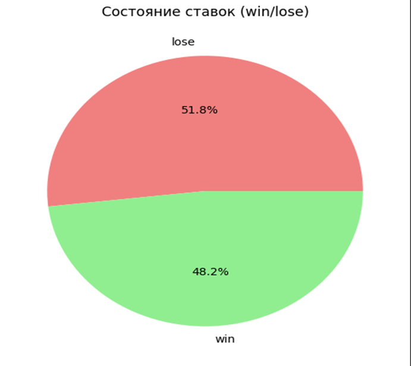

# Report: Analysis and Insights on Multiplayer Betting Game Trends and Profitability in "The Crash" Game

## Done by 
- Akhatov Aidos - 220107048
- Mukashev Sultan - 220107032 

## Abstract
This report analyzes trends and profitability in the multiplayer betting game "The Crash" using large-scale datasets and advanced data processing techniques. The study investigates player behavior, currency preferences, and game mechanics to uncover patterns that drive engagement and profitability. Key findings reveal that cryptocurrencies dominate betting activities, with game outcomes heavily favoring providers over players. Temporal analyses suggest strategic game designs align with salary cycles to enhance player retention. Additionally, user-specific insights indicate no correlation between high engagement and profitability, with frequent players incurring significant losses. The report underscores the exploitative nature of gambling systems and offers recommendations for policy regulation, further research, and educational campaigns to mitigate societal harm.

---

## Data Overview

The dataset consisted of two primary tables:
1. **Bets**: Details of individual betting activities, including amounts, outcomes, and currencies.
2. **Games**: Information about each game session, including player counts and profitability.

### Initial Analysis

- **Bets Table**: Over 25 million rows detailing player bets.
- **Games Table**: More than 70,000 rows providing game-level data.
- Missing values were mostly observed in fiat-related columns, which were deemed less critical due to the dominance of cryptocurrency transactions.

---

## Methodology

### 1. Data Preparation using PySpark
Data preparation involved cleaning and encoding categorical variables:
- Missing values were handled by dropping rows or substituting default values.
- Categorical data (e.g., game type, bet status) was encoded into numeric formats using predefined mappings.

### 2. Data Transformation using PySpark
The cleaned dataset was transformed into a structured format suitable for analysis:
- Individual game types (e.g., "yellow," "red") were analyzed separately.
- Encoded data was saved as a Parquet file for efficient storage and retrieval.

### 3. Analytical Framework
Key analyses included:
- Distribution of bets by cryptocurrency.

    
- Win/Lose distribution of bets.

    
- Average profits by game type.

    
- Profit trends over time.

    
- Profit trends by number of players.

    
- User-specific insights, including engagement levels and financial outcomes.

    
    
    
    
    
---

## Key Findings

### 1. Betting Patterns by Currency
- **Dominance of Cryptocurrency**: Over 29 distinct cryptocurrencies were used.
- A bar chart visualized the frequency of bets for each cryptocurrency, highlighting the most and least popular options.

### 2. Bet Outcomes and Profitability
- **Win/Lose Distribution**: A pie chart revealed a high percentage of losses, emphasizing the profitability of such games for providers.
- **Average Profits by Game Type**: A bar chart showed that three out of four game types resulted in net losses for players.

### 3. Temporal Profit Trends
- **Seasonal Patterns**: A line chart displayed daily profitability trends. Observations suggested that game design might exploit salary cycles to maximize player engagement during specific periods.

### 4. User Behavior Insights
- **Top Players by Engagement**: Most active users were identified based on the number of games played. However, frequent players often incurred significant losses.
- **Profit/Loss Extremes**: Users with the largest profits and losses revealed no overlap, indicating that high engagement did not correlate with profitability.

### 5. Profitability vs. Player Volume
- **Correlation Analysis**: A scatter plot showed that increased player counts generally reduced individual winnings, ensuring sustainable profits for game providers.

---

## Conclusions

The study highlights the systemic advantages for game providers in multiplayer betting games like "The Crash." Key insights include:
- Increased player engagement correlates with higher player losses.
- Game mechanics and timing are likely designed to maximize provider profitability.

### Ethical Implications
The exploitative nature of gambling systems underscores the need for better regulations and awareness campaigns to protect players.

---

## Recommendations

### 1. Policy Implications
Regulatory bodies should scrutinize game mechanics to ensure transparency and fairness in gambling activities.

### 2. Further Research
Future studies should investigate the impact of specific promotional strategies on player behavior.

### 3. Educational Campaigns
Awareness programs about the risks of gambling can help mitigate its negative societal impacts.
